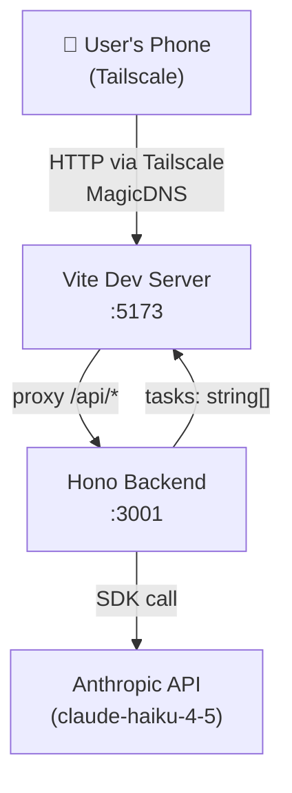
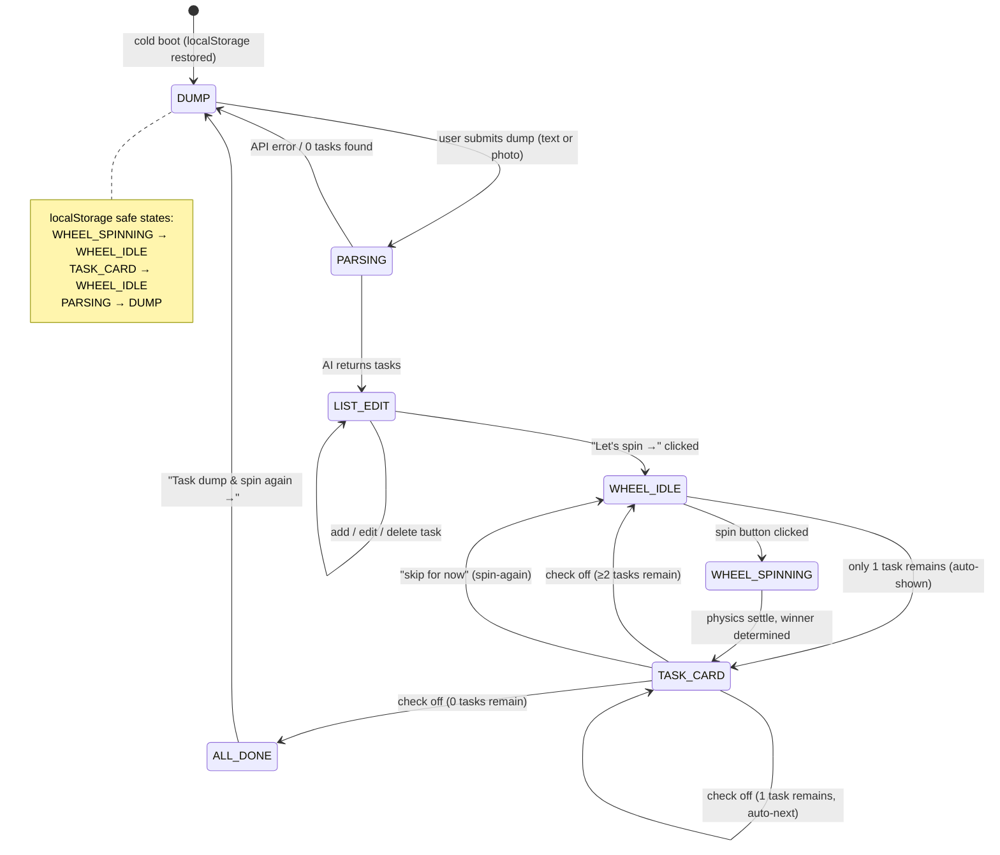
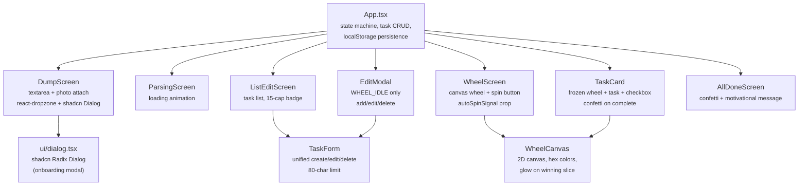
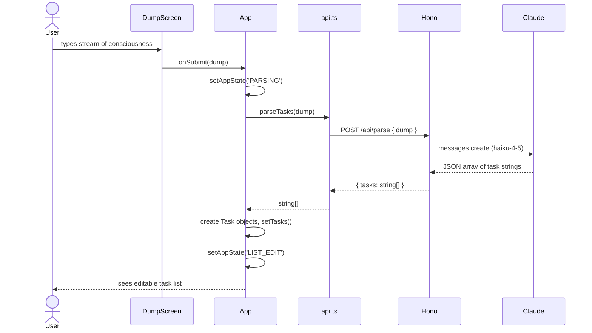
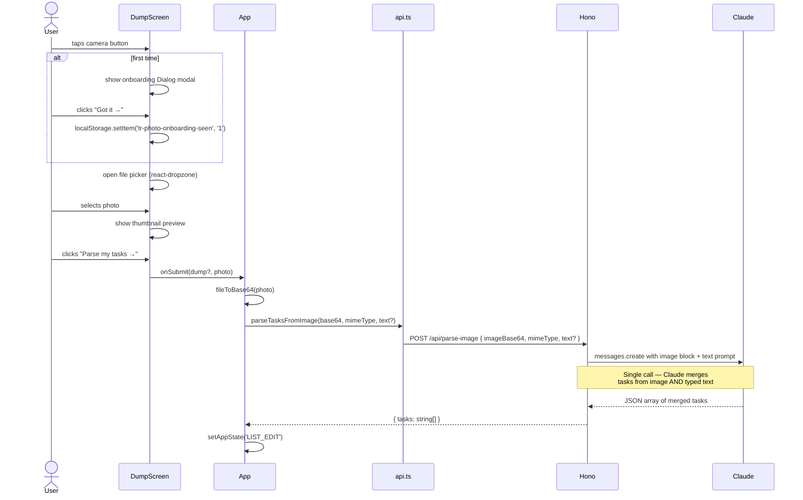

# ADR-001: TaskRoulette — Full Implementation Overview

**Status:** Active  
**Date:** July 2025  
**Authors:** AI agent build (multi-session, Claude Sonnet 4)  
**Repo:** https://github.com/oliverswitzer/taskroulette

---

## What Is TaskRoulette

A dopamine-driven PWA for ADHD task paralysis. The user voice-dumps or photo-dumps everything swirling in their head. An AI distills it into a concrete task list. They spin a prize wheel — it picks a task for them, removing the decision overhead that triggers paralysis. They check it off, get confetti, spin again. When all tasks are done, a rotating AI message celebrates what they accomplished.

The product philosophy: **dopamine is the product, not productivity**. Every animation, every interaction exists to make starting feel rewarding rather than anxious.

---

## ⚠️ Important Takeaways for Future Agents

> Read this before touching any code.

### 1. Vite + Tailscale — `allowedHosts` is mandatory
Vite 6 blocks requests from unknown hostnames with a blank 403. Any access via Tailscale (`clawlivers-mac-mini.tail60e2f.ts.net`) silently fails without this in `vite.config.ts`:
```ts
server: { host: true, allowedHosts: ['clawlivers-mac-mini.tail60e2f.ts.net'] }
```
This has broken the build multiple times. Check it first when debugging mobile access issues.

### 2. React StrictMode kills `setTimeout` in `useEffect` cleanups
In dev, StrictMode double-invokes effects. Any `setTimeout` inside a `useEffect` with a `return () => clearTimeout(timer)` cleanup gets cancelled before it fires. This caused the auto-spin feature to silently fail in dev. The fix: use a **counter signal prop** (`autoSpinSignal: number`) incremented by the parent, watched by `useLayoutEffect` with a `prevSignalRef` guard. No setTimeout. No cleanup race.

### 3. `useWheelPhysics` must use refs, not state, inside RAF loops
`setPhysics(prev => ...)` inside `requestAnimationFrame` reads stale state — the closure captures the initial `prev`. Velocity never actually decays. The fix: all mutable animation values (`angleRef`, `velocityRef`, `isSpinningRef`) live in refs. Only call `setState` for display updates. This bug is invisible in real browsers but breaks Playwright headless tests.

### 4. `AnimatePresence mode="wait"` crashes on rapid double-transitions
When `handleTaskComplete` set state → `WHEEL_IDLE` and a `useEffect` immediately re-set it to `TASK_CARD` (the 1-task-remaining case), `AnimatePresence` collapsed to a black screen. Fix: handle the 1-remaining case directly inside the handler — skip `WHEEL_IDLE` entirely, go straight to `TASK_CARD`. Also key task card by task ID (`key={task-card-${selectedTask?.id}}`), not a static string, so transitions animate on task change.

### 5. localStorage must sanitize transient states on cold boot
`WHEEL_SPINNING` and `TASK_CARD` are transient states with ephemeral runtime data (`selectedTask`, wheel physics) that isn't persisted. Restoring them from localStorage on a cold boot causes blank screens. `loadAppState()` maps: `WHEEL_SPINNING → WHEEL_IDLE`, `TASK_CARD → WHEEL_IDLE`, `PARSING → DUMP`. Safe states (`DUMP`, `LIST_EDIT`, `WHEEL_IDLE`, `ALL_DONE`) pass through unchanged.

### 6. Never hardcode `localhost` API URLs in frontend code
`const API = 'http://localhost:3001'` works on the dev machine but silently fails on any real device — `localhost` on the phone is the phone. Always use relative paths (`/api/...`) + Vite's proxy (`server.proxy: { '/api': 'http://localhost:3001' }`).

### 7. Canvas 2D does not support OKLCH colors
`ctx.fillStyle = 'oklch(72% 0.2 30)'` silently falls back to black. No error thrown. Pre-compute hex equivalents for any canvas drawing. The design system uses OKLCH tokens but the wheel canvas must use hardcoded hex values.

### 8. Both servers must be running
The app requires two processes:
```bash
# Terminal 1 — Hono backend (Anthropic proxy)
cd ~/workspace/taskroulette && source ~/.envrc && npx tsx server.ts

# Terminal 2 — Vite frontend
cd ~/workspace/taskroulette && npm run dev
```
The `ANTHROPIC_API_KEY` is read from `~/.envrc`. The server will start silently and fail all API calls if the key isn't sourced.

### 9. Playwright E2E: `devices['iPhone 14']` requires webkit
`devices['iPhone 14']` maps to the webkit browser. Only chromium is installed. Use an explicit chromium config with manual UA/viewport instead. See `playwright.config.ts`.

### 10. `write_file` is the only safe way to create TSX files from agents
Routing TSX through `execute_code` Python string interpolation mangles single quotes into `\\'` literals, causing Vite parse errors. Always use `write_file` directly for `.tsx`/`.jsx` content.

---

## Architecture

### System Topology



The frontend never talks to Anthropic directly. All AI calls are proxied through the Hono server, which reads the API key from `~/.envrc` at startup. This is a hard architectural constraint — browser CORS blocks direct Anthropic calls.

### Frontend App State Machine



**Transient states** (`PARSING`, `WHEEL_SPINNING`, `TASK_CARD`) are never restored from localStorage — they have ephemeral runtime data (API response in flight, physics state, `selectedTask`) that can't survive a page reload.

---

## Component Tree



---

## Data Flow: Text Brain Dump



---

## Data Flow: Photo Parse (Claude Vision)



---

## Wheel Physics

```mermaid
flowchart TD
    A["User clicks Spin button"] --> B["randomVelocity()<br/>0.008–0.015 rad/ms"]
    B --> C["isSpinningRef = true<br/>requestAnimationFrame loop starts"]
    C --> D["Each frame:<br/>velocity *= 1 - FRICTION (0.025)<br/>angle += velocity * Δt"]
    D --> E{velocity < MIN_VELOCITY<br/>OR elapsed > 5000ms?}
    E -->|No| D
    E -->|Yes| F["calculateWinner(angle, sliceCount)<br/>= floor((TAU - normalizedAngle) / sliceAngle)"]
    F --> G["setPhysics(final state)<br/>onComplete(winnerIndex)"]
    G --> H["App: setAppState('TASK_CARD')"]

    style A fill:#2d1a0e,stroke:#E8532A
    style H fill:#1a2d1a,stroke:#2BA84A
```



**Key physics constants:**
| Constant | Value | Why |
|---|---|---|
| `WHEEL_FRICTION` | 0.025/frame | Decelerates in ~3-5s — feels real |
| `MIN_VELOCITY` | 0.0005 rad/ms | Stop threshold |
| `MAX_SPIN_MS` | 5000ms | Hard cap so it never loops forever |
| All state in refs | — | Prevents stale closure in RAF loops |

---

## Decisions Log

### D1: 2D Canvas Wheel (not Three.js / CSS transforms)
**Decision:** Use HTML5 2D canvas for the wheel.  
**Alternatives considered:** Three.js (3D), CSS `transform: rotate()` on a DOM-built wheel, SVG.  
**Rationale:** 2D canvas gives precise slice boundary control, easy text truncation, and custom glow effects per-slice. Three.js adds ~300KB and a render pipeline for what is fundamentally a flat spinning disc. CSS transforms on DOM slices require clipping math. Canvas is the minimum viable graphics primitive for this shape.  
**Consequence:** Canvas does not support OKLCH color syntax — all wheel colors must be pre-converted to hex.

### D2: Hono Backend for Anthropic Proxy
**Decision:** Run a Hono server on `:3001`, proxy'd via Vite's `server.proxy`.  
**Alternatives considered:** Edge functions (Vercel/Netlify), direct browser fetch.  
**Rationale:** Browser cannot call Anthropic API directly (CORS). Edge functions add deploy complexity. Hono + `npx tsx server.ts` runs in a single terminal command, reads API key from `~/.envrc`, and is testable with plain `curl`.  
**Consequence:** App requires two running processes. The `ANTHROPIC_API_KEY` must be in environment before starting the server.

### D3: Single Claude Call for Photo + Text
**Decision:** One Claude vision call combining image and typed text.  
**Alternatives considered:** Tesseract.js (client-side OCR) + existing text parse, two separate calls merged.  
**Rationale:** Claude vision dramatically outperforms Tesseract on handwriting and context inference ("tmrw dentist 3pm" → "Dentist appointment tomorrow at 3pm"). Single call lets Claude reason about overlap and deduplicate. Marginal cost (~$0.003/image) is irrelevant at this scale.  
**Consequence:** Photo route requires internet. HEIC images are remapped to `image/jpeg` media type (Claude doesn't accept `image/heic`).

### D4: Fixed Wheel Slice Positions
**Decision:** Slices don't shuffle between spins. A task at position 3 is always at position 3.  
**Rationale:** Shuffling between spins would feel random and undermine user trust in the wheel. Completed tasks are removed and the wheel shrinks. "Spin again" returns to the same wheel at the same angle.  
**Consequence:** `task.position` is set at parse time and never changes. The wheel re-renders on task completion with one fewer slice.

### D5: `autoSpinSignal` Counter Pattern (not setTimeout)
**Decision:** Auto-spin after "skip for now" uses a counter prop incremented by the parent, not a `setTimeout` in a `useEffect`.  
**Rationale:** React StrictMode in dev double-invokes effects and cancels setTimeout cleanups. The counter pattern is StrictMode-safe: first invocation sets `prevSignalRef.current = N`, second invocation sees `N <= N` and returns early. Exactly one `startSpin()` call.  
**Consequence:** `WheelScreen` takes `autoSpinSignal: number` prop. Any parent that wants to trigger auto-spin increments it. Pattern is reusable for any "trigger once, survive StrictMode" scenario.

### D6: Task Cap Enforced in UI, Not Server
**Decision:** The 15-task limit is enforced in `ListEditScreen` (disables "Let's spin" CTA, shows 3/15 badge), not in the server parse routes.  
**Rationale:** The server doesn't know whether the user will delete tasks before proceeding. Capping at the server means a 16-item list photo silently loses a task. The UI is the right gate — the user can see and manage the cap.  
**Consequence:** Both `/api/parse` and `/api/parse-image` return however many tasks Claude finds. `ListEditScreen` shows the count and blocks progression at >15.

### D7: Tailwind Coexists with Inline Styles
**Decision:** Installed Tailwind v4 purely as a shadcn dependency. All existing inline `style={{}}` props were kept as-is.  
**Rationale:** Converting 2,800+ lines of inline styles to Tailwind classes mid-build is a refactor risk with no user-visible upside. Tailwind was needed only for shadcn's `cn()` utility and Dialog component. Both can coexist — Tailwind's `@import "tailwindcss"` at the top of `index.css` doesn't conflict with existing `:root` CSS custom properties.  
**Consequence:** The codebase uses inline styles for all component UI and Tailwind utilities only in `src/components/ui/` (shadcn). Don't start converting one to the other without a plan to convert all.

### D8: shadcn Dialog for Onboarding Modal
**Decision:** Use shadcn's Radix Dialog for the photo onboarding modal.  
**Alternatives considered:** Custom CSS modal, browser `alert()`, `<details>` popover.  
**Rationale:** Radix Dialog handles focus trapping, escape key, backdrop click, and ARIA accessibility automatically. The shadcn wrapper applies the existing design token colors. Building an accessible modal from scratch is ~100 lines of boilerplate with footguns.  
**Consequence:** `components.json` config file, `src/lib/utils.ts` `cn()` helper, and `src/components/ui/dialog.tsx` were added. Only one shadcn component in the project.

---

## File Map

```
taskroulette/
├── server.ts                    # Hono backend — /api/parse, /api/parse-image, /api/health
├── vite.config.ts               # allowedHosts for Tailscale, proxy to :3001
├── playwright.config.ts         # mobile (375px chromium) + desktop projects
├── components.json              # shadcn config
│
├── src/
│   ├── App.tsx                  # State machine, task CRUD, photo state, localStorage sync
│   ├── api.ts                   # parseTasks(), parseTasksFromImage()
│   ├── audio.ts                 # Web Audio mechanical tick (bandpass noise burst)
│   ├── constants.ts             # MAX_TASKS=15, physics constants, OKLCH colors, messages
│   ├── storage.ts               # localStorage helpers — loadAppState() sanitizes transients
│   ├── types.ts                 # Task, AppState, PhysicsState, WheelConfig
│   ├── lib/utils.ts             # shadcn cn() helper
│   │
│   ├── hooks/
│   │   ├── useWheelPhysics.ts   # RAF loop using refs — no stale closures
│   │   ├── useTasks.ts          # Task CRUD (used by EditModal/ListEdit)
│   │   └── useAudioTick.ts      # Web Audio context + tick function
│   │
│   └── components/
│       ├── DumpScreen.tsx        # Textarea + react-dropzone photo attach + onboarding modal
│       ├── ParsingScreen.tsx     # Loading animation during AI call
│       ├── ListEditScreen.tsx    # Editable task list, 15-cap badge, Let's spin CTA
│       ├── WheelScreen.tsx       # WheelCanvas + spin button + autoSpinSignal handler
│       ├── WheelCanvas.tsx       # 2D canvas wheel — hex colors, glow, text truncation
│       ├── TaskCard.tsx          # Frozen wheel + task text + checkbox + confetti
│       ├── EditModal.tsx         # WHEEL_IDLE-only task management (add/edit/delete)
│       ├── TaskForm.tsx          # Unified create/edit/delete — 80-char limit
│       ├── AllDoneScreen.tsx     # Confetti + rotating motivational message
│       └── ui/dialog.tsx         # shadcn Radix Dialog (photo onboarding only)
│
├── tests/
│   ├── unit/
│   │   ├── wheelPhysics.test.ts  # Pure physics functions (decayVelocity, calculateWinner)
│   │   ├── taskCrud.test.ts      # Task CRUD operations
│   │   ├── parseTasks.test.ts    # api.ts fetch wrapper
│   │   └── storage.test.ts       # localStorage helpers + transient state sanitization
│   ├── component/
│   │   ├── DumpScreen.test.tsx   # Photo attach, onboarding seen flag, parse button states
│   │   ├── ListEditScreen.test.tsx
│   │   └── TaskForm.test.tsx
│   └── e2e/
│       ├── real-api.spec.ts      # ★ REAL Anthropic API calls — text, photo, combined, full flow
│       ├── wheel.spec.ts         # Wheel interactions
│       ├── state-machine.spec.ts # State transitions
│       ├── parse-api.spec.ts     # Original parse E2E
│       └── fixtures/
│           └── task-list.png     # 600×400 PNG with 3 tasks — used by vision E2E tests
│
└── docs/adrs/
    └── ADR-001-implementation-overview.md  # This file
```

---

## Test Coverage Summary

| Layer | Count | Notes |
|---|---|---|
| Unit | 74 | Physics, CRUD, storage, API wrapper |
| Component | 26 | DumpScreen (photo states), ListEdit, TaskForm |
| E2E (mocked) | ~13 | State machine, wheel interactions |
| E2E (real API) | 5 | Full text flow, vision OCR, combined, onboarding, remove |
| **Total** | **~118** | All passing at time of writing |

The real-API E2E suite (`real-api.spec.ts`) is the most valuable test. It is the only test that proves the full vertical stack works: browser → Vite proxy → Hono → Anthropic → UI render.

---

## Known Limitations / Future Work

- **No voice input yet** — the "voice dump" in the original spec is currently a textarea. Web Speech API or Whisper via a new server route would be the natural next step.
- **PWA install not tested on device** — manifest and service worker are present but haven't been end-to-end tested for Add to Home Screen on iOS Safari.
- **localStorage only** — no sync, no account. Fine for MVP. Multi-device or backup would require a backend persistence layer.
- **HEIC→JPEG remapping is a lie** — the server tells Claude the HEIC image is `image/jpeg` in the media_type field. This works because HEIC often decodes fine, but a proper implementation would server-side transcode via `sharp` or similar.
- **Tailscale serve not configured** — microphone access (for future voice feature) requires HTTPS on iOS. Plain `http://` Tailscale URLs work for current features but will block `getUserMedia`. Run `tailscale serve --bg http://localhost:5173` for HTTPS when voice is added.
